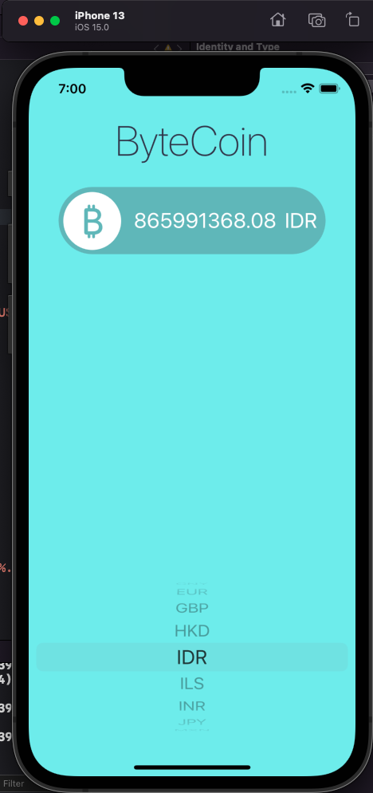

# ByteCoin-iOS13

## Our Goal
The goal is to create an app that can get bitcoin's price rate for a list of exchanges.

## What we've created
By the end of the project, we got an app that can show in a beautiful way bitcoin's price rate for a list of exchanges.

## What we've learned

* Learn about the delegate pattern.
* Swift protocols and extensions. 
* Learn to use URLSession to network and make HTTP requests.
* Parse JSON with the native Encodable and Decodable protocols. 

>This is a companion project to The App Brewery's Complete App Development Bootcamp completed by Luiz Silva.
